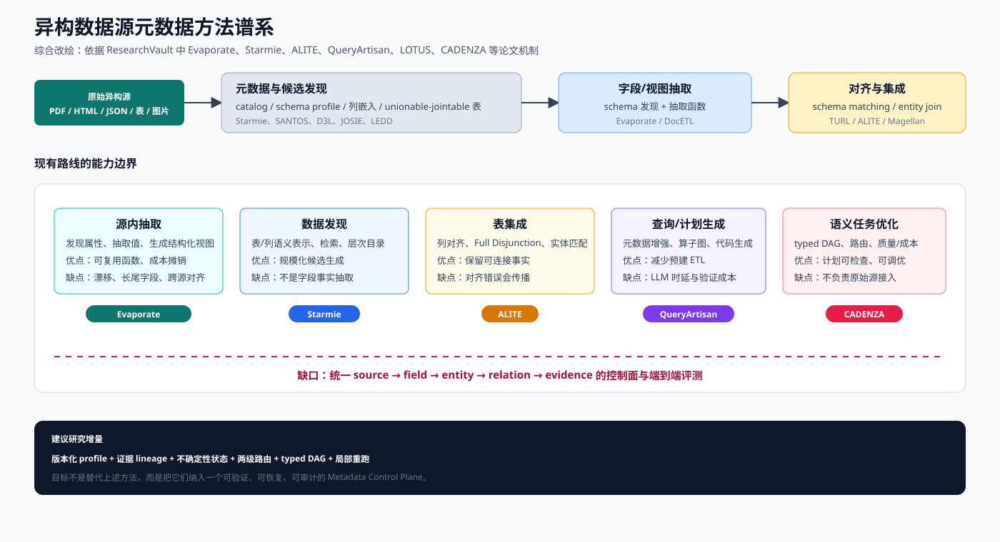
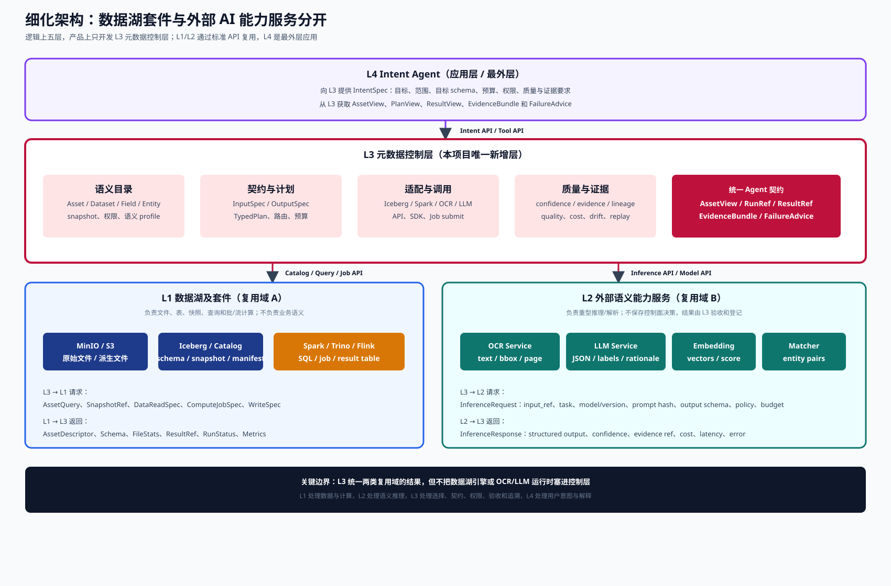
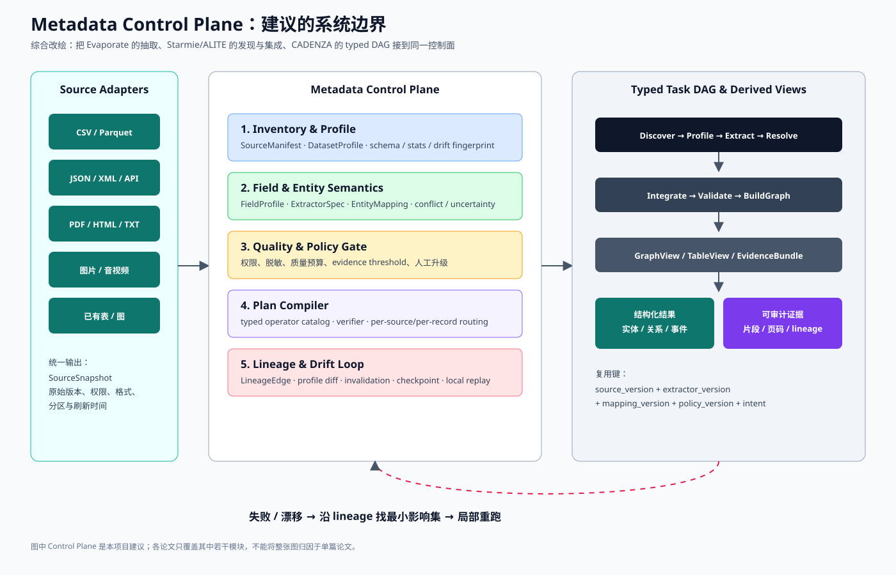
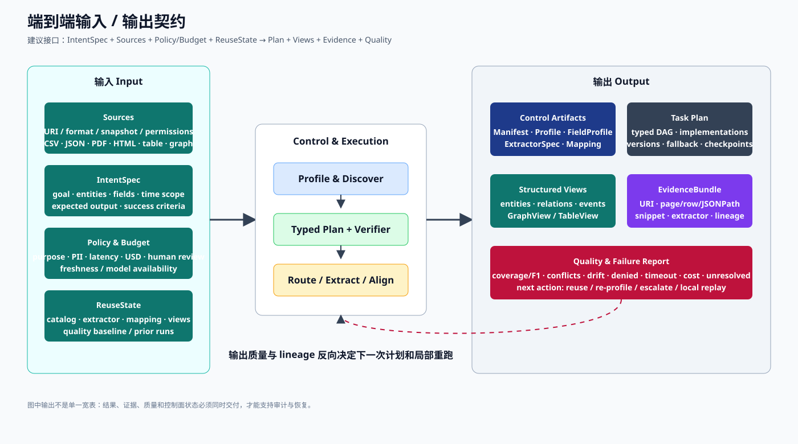

# 面向异构数据源提取的元数据控制层调研

更新时间：2026-09-18  
范围：ResearchVault 现有异构数据湖调研 + Google Scholar 检索线索；优先采用 CCF A / PVLDB、SIGMOD、VLDB、ICDE 等高水平来源。

## 结论

目前没有一篇论文完整解决“PDF/HTML/JSON/CSV/图片/数据库 → 元数据 → 结构化实体/关系 → 可追溯结果”的端到端问题。现有方法分成五类：

1. **源内 schema/字段抽取**：Evaporate 从少量文档发现属性并合成可复用抽取函数；适合 PDF/HTML/TXT，但不负责跨源实体对齐。
2. **全湖目录与数据发现**：LEDD 用层次聚类、列嵌入和 LLM 摘要构建语义目录；Starmie、SANTOS、D3L、JOSIE 等以列/表表示和相似度检索寻找 unionable/joinable 表。
3. **schema matching 与表集成**：ALITE 用 TURL 表示、列聚类和 Full Disjunction 集成相关表；TURL/SATO/Sherlock 等提供表理解或语义类型信号。
4. **查询时元数据增强与代码/计划生成**：QueryArtisan 把 schema、样例、统计和算子库交给 LLM，生成异构处理代码；CADENZA/LOTUS/DocETL 进一步把语义任务显式化为可验证算子或 typed DAG。
5. **数据系统控制面**：Lakehouse、Data Civilizer、Aurum 等强调开放文件、目录、版本和治理，但通常不解决开放世界字段抽取和跨模态语义对齐。

因此，我们要做的“元数据控制层”不应只是 catalog，也不应只是 LLM 抽取器。它应是一个**带版本、证据、权限、质量、lineage 和可执行契约的控制平面**，向下管理多源适配器，向上为 typed DAG/查询/图分析提供可信的 `DatasetProfile`、`FieldProfile`、`EntityMapping` 和 `EvidenceBundle`。



> 图 1。综合改绘，不是任何单篇论文的原图。图中方法位置依据 ResearchVault 笔记：Evaporate 负责源内结构化视图，Starmie/ALITE 负责发现与集成，QueryArtisan/CADENZA 负责查询或任务计划；红色虚线表示当前端到端缺口。

## 证据强度与高水平论文优先级

ResearchVault 中可直接回查正式全文的高水平主线如下。PVLDB 是 VLDB 体系的正式出版物；SIGMOD、VLDB、ICDE 等会议通常属于 CCF 数据库 A 类。PVLDB 是否在你们单位的“一区/CCF A 等效”口径中计入，仍应按最新版目录确认。

| 论文/系统 | 出处 | 对本项目的直接价值 | 主要缺口 |
|---|---|---|---|
| Starmie | PVLDB 16(7), 2023 | 无监督上下文列表示、HNSW/剪枝、表联合搜索；适合作为候选数据集发现层 | 目标是 unionability，不是字段抽取；近似索引有召回损失；无原始文档处理 |
| ALITE | PVLDB 16(4), 2022 | TURL 列表示、列对齐、带标签空值和 Full Disjunction；适合作为跨表集成层 | 列对齐错误向下游传播；不处理 PDF/图片/开放字段；实体解析实验有限 |
| Evaporate | PVLDB 17(2), 2023 | 从 HTML/PDF/TXT 少量样本发现 schema，合成多抽取函数并弱监督聚合 | 稀有字段漏检；代码安全/漂移机制不足；不做跨源实体消歧、权限和 lineage |
| QueryArtisan | PVLDB 18(2), 2024 | 元数据+样例+算子图约束 LLM，查询时生成异构数据处理代码 | 把 ETL 维护转移为 metadata/operator/verifier 维护；生成时延高；元数据陈旧行为不明 |
| LOTUS | PVLDB 18(11), 2025 | 语义算子的逻辑/物理分离、参考算法和单算子质量—成本约束 | 只保证单算子相对参考实现；不覆盖目录、权限、跨源 lineage 和全流程 DAG |
| DocETL | PVLDB 18(9), 2025 | 文档重写、generation/validation agent 和局部计划优化 | 验证器也是 LLM；候选计划仍有致命错误；成本/时延常上升 |
| CADENZA | arXiv 2026，作者称 accepted to SIGMOD 2027，尚未正式出版 | typed TxRA DAG、任务输出关系化、逐 tuple 异构后端路由和 Q/L/C 联调 | 从 typed relation 开始；不负责文件发现、解析、schema matching、实体消歧；只优化单个 semantic operator |

Google Scholar 侧建议优先补核以下经典 CCF A/高水平近邻：**JOSIE（SIGMOD 2019，joinable table discovery）**、**SANTOS（PVLDB，semantic table union search）**、**D3L（ICDE，deep learning data-lake discovery）**、**Sherlock/SATO（表语义类型与上下文理解）**、**TURL（表表示学习）**、**Magellan（VLDB，entity matching 管理系统）**。用户已完成 Scholar 人机验证；本轮仍只把 Scholar 作为题名/出处检索入口，不把搜索结果页的引用次数或分区标签当作证据。正式引用前应再点击 Scholar 条目并用 DBLP/出版社页交叉核对。不要把 LEDD、CADENZA 或其他 arXiv/demo 论文与已正式发表的 PVLDB/CCF A 论文混写成同等证据。

## 现有方法的共同缺点

### 1. 元数据粒度断裂

目录方法通常停留在 dataset/table/column；抽取方法通常输出 field/value；查询方法使用 schema/sample/statistics。三者之间缺少统一的、可组合的 `source → document → record → field → entity → relation` 层次模型。

### 2. 把“抽不到”与“没有该字段”混为一谈

Evaporate 已指出 `abstain`、空值和真实缺失必须区分；但多数 catalog 或 schema matching 方法只保存最终列/匹配分数，没有保存候选函数、失败原因、证据片段和不确定性。

### 3. 静态快照无法应对 schema/data drift

字段名、文档模板、供应商 API 和数据分布会变化。现有工作多以离线建索引或一次性实验为主，缺少 profile diff、规则失效检测、增量重抽取和版本兼容协议。

### 4. 只优化局部目标

Starmie 优化检索，ALITE 优化集成，Evaporate 优化抽取成本/质量，CADENZA 优化单算子质量/时延/成本。缺少端到端目标：字段 F1、实体匹配 F1、关系正确率、证据覆盖率、延迟、费用、权限合规和可恢复性需要一起评估。

### 5. 评测与真实生产不对称

许多方法使用小规模标注集、oracle LLM、单一供应商数据或 demo 场景；跨格式、长尾字段、权限拒绝、删除源、重复数据、增量更新和错误回溯覆盖不足。

### 6. LLM 生成结果缺少确定性边界

LLM 可做 schema 归纳、字段语义解释和候选计划生成，但不应直接决定权限、实体合并或最终事实。需要 schema/type checker、规则校验、参考实现、隔离执行、证据阈值和人工升级路径。

## 我们建议的改进：Metadata Control Plane

### 在“数据湖 → 意图 Agent”中的位置

元数据控制层处于**Iceberg 表事实层之上、执行层和意图 Agent 之下**，属于控制平面和语义契约层；Intent Agent 是最外层的应用平面：

```text
L0 原始对象与数据源（事实平面）
    ↓ 原始内容、URI、格式、权限、更新事件
L1 Iceberg 表事实与 Catalog（快照/版本平面）
    ↓ table/snapshot/schema/file statistics
L2 语义元数据控制层（本项目）
    ↓ 可见性/可执行性/可信度/可恢复性 + typed contract
L3 执行与结果层（SQL / Python / LLM / 图计算 / Serving）
    ↺ 质量、漂移、失败和成本回流 L2
L4 意图 Agent（应用层，最外层）
    ↔ 调用 L2 获取契约，调用 L3 执行计划并接收反馈
```

#### 下层 L0 需要提供什么

L0 不需要理解业务语义，但必须提供可定位、可复现的事实：

| 信息 | 最小要求 | L2 用途 |
|---|---|---|
| 源定位 | `source_id`、URI/连接器、分区、租户 | 建立 `SourceManifest` 和权限裁剪 |
| 版本与新鲜度 | snapshot/version、更新时间、变更日志或可重放快照 | 增量 profile、漂移检测、结果复现 |
| 原始内容 | 文件/表/API 返回值、格式、编码、语言/模态 | 解析、抽样、schema 与字段抽取 |
| 访问能力 | read capability、凭证引用、脱敏/用途限制 | 决定哪些 profile 和证据可暴露给上层 |
| 定位信息 | 行号、页码、JSONPath、图像区域或记录主键 | 生成 `EvidenceBundle` 和 lineage |

L0/L1 不应把“字段含义、实体是否相同、使用哪个模型”直接写死在存储层；这些属于 L2/L3 的可变控制逻辑。

#### 上层 L3/L4 需要提供什么

意图 Agent 不能只提交一句自然语言，还要提供可执行约束；执行层则要回传观测：

| 上层输入 | 必填信息 | L2 如何使用 |
|---|---|---|
| 业务意图 | `goal`、实体/关系范围、时间窗、期望输出 | 缩小候选数据集、字段和抽取任务 |
| 目标 schema | 字段名/类型/单位、必需与可选字段、关系约束 | 生成 `FieldProfile`、匹配 canonical field、检查类型 |
| 策略约束 | 身份、用途、PII、数据驻留、人工升级规则 | 权限裁剪、证据脱敏、拒绝不合规计划 |
| 资源预算 | 时延、费用、模型可用性、人工审核额度 | 选择规则/小模型/大模型和缓存策略 |
| 质量要求 | 最低 coverage/F1、冲突阈值、证据完整性 | 设定质量门、升级链和停止条件 |
| 历史状态 | catalog/extractor/mapping/view 版本 | 复用、失效和局部重跑 |
| 执行回报 | 成功/失败、质量、成本、延迟、漂移信号 | 更新质量历史，修正路由和 profile |

#### L2 必须向上提供什么数据

L2 对上层的交付不是一张“元数据表”，而是四类可以直接驱动 Agent 决策的对象：

1. **可见性信息**：候选数据集、字段、实体、关系、版本和权限裁剪结果；明确说明“不可见”与“未发现”的区别。
2. **可执行性信息**：每个节点的 `InputSpec`、`OutputSpec`、类型、依赖字段、候选实现、参数范围、成本/时延历史和回退路径。
3. **可信度信息**：字段/实体/关系的置信度、证据定位、冲突、`missing`、`abstain`、`parse_error`、`policy_denied` 等状态。
4. **可恢复性信息**：对象版本、`LineageEdge`、质量报告、失效原因、检查点和最小影响集，使 Agent 能选择复用、重试、升级模型或局部重跑。

上层 Agent 最终应能基于这些信息回答四个问题：**能不能读？读到的是什么？结果有多可信？失败后从哪里恢复？**

### 如果复用 Iceberg：控制层如何重新定位

结合当前 YiDataLake 的实现，推荐采用“**Iceberg 做基础元数据平面，控制层做语义控制平面**”的组合，而不是把 Iceberg Catalog 当成完整的元数据控制层：

这里的 L0-L4 只是说明 Iceberg、执行引擎和 Agent 的内部职责，不代表要开发五个产品层。按本项目的工程边界，应把它们收束为“复用平台层 → 元数据控制层 → 应用层”三层。

| 层级 | 建议组件 | Iceberg 已经提供 | 仍需补充 |
|---|---|---|---|
| L0 原始事实 | MinIO/S3、文件/API/数据库适配器 | 不负责 | 源定位、快照、权限、原始证据坐标 |
| L1 表事实与版本 | Iceberg + REST Catalog；可替换 Polaris/Nessie/Hive Catalog | schema、partition、manifest、snapshot、time travel、原子提交、表名到 metadata location 的指针 | 文档字段语义、抽取函数、实体映射、业务术语、质量门和 Agent 契约 |
| L2 语义控制面 | 本项目服务 + Iceberg control tables；治理场景可同步 OpenMetadata/DataHub/Atlas | 可作为持久化底座，复用快照、SQL 查询、版本和回滚 | `DatasetProfile`、`FieldProfile`、`ExtractorSpec`、`EntityMapping`、`QualityReport`、`LineageEdge`、权限裁剪 |
| L3 执行与服务（复用） | 现有 Spark/Flink/Trino、OCR/LLM、图计算、Serving | 读写 Iceberg 表并提交派生快照 | 本项目不自研执行引擎，只负责提交、轮询和接收结果 |
| L4 意图与规划（应用层） | Intent Agent、typed DAG compiler、operator catalog | 通过控制层访问表和快照引用 | `IntentSpec`、目标 schema、预算、证据要求、候选任务图 |

#### Iceberg 基础元数据应该交给控制层什么

每个进入控制层的 Iceberg 表/快照，至少要解析并登记：

- `catalog_name`、namespace、`table_identifier`、`metadata_location`；
- `snapshot_id`、父快照、提交时间、快照摘要和可接受的新鲜度；
- schema、字段 ID、逻辑类型、字段变更历史、partition spec；
- manifest/file URI、分区值、记录数、文件大小和列统计；
- 表级/列级权限标签、数据保留策略和删除语义；
- 与原始文件/API 的 `source_id`、外部版本和证据定位的映射。

控制层不应让 Agent 直接解析 `metadata.json` 或 manifest 文件；应通过 Iceberg REST Catalog、Spark/Trino/Flink 或 Iceberg SDK 获取稳定的表/快照引用，再把 `snapshot_id` 固定到任务计划中。

#### 控制层要给 Intent Agent 什么

Agent 真正需要的是“可行动元数据”，而不是 Iceberg 原始 JSON：

```json
{
  "asset": {
    "table": "lake.yigraph.entity_mentions",
    "snapshot_id": 183746291,
    "schema": [{"name": "canonical_entity_id", "type": "string"}],
    "permission": "case-read"
  },
  "semantic_fields": [{
    "name": "entity_name",
    "canonical_type": "PersonName",
    "evidence": "s3://raw/investigations/a.pdf#page=4",
    "confidence": 0.94,
    "status": "verified"
  }],
  "operators": [{
    "name": "ResolveEntity",
    "input": "EntityMentionSet",
    "output": "EntityMapping",
    "quality_floor": 0.90,
    "cost_usd_per_1k": 0.12
  }],
  "lineage": {"source_version": "...", "extractor_version": "..."}
}
```

也就是说，L2 至少要把以下信息编译给 Agent：

1. **可用资产**：允许访问的表、文件、视图、快照及候选字段；
2. **语义解释**：字段的 canonical type、单位、同义字段、实体/关系候选；
3. **可执行契约**：节点 `InputSpec`/`OutputSpec`、依赖字段、候选实现、成本/时延、回退路径；
4. **可信度与证据**：置信度、质量历史、原文片段、页码/行号/JSONPath、冲突和不确定性状态；
5. **复用与恢复**：可复用视图、snapshot pin、lineage、失效原因、检查点和最小重跑范围。

#### 复用 Iceberg 后的端到端流程

```text
原始源 / API / 文件
  → SourceAdapter + 原始对象（MinIO/S3）
  → Profile / Parse / Extract
  → Iceberg bronze 表（原始记录、文档块、解析结果）
  → Metadata Control Plane
      ├─ DatasetProfile / FieldProfile
      ├─ ExtractorSpec / EntityMapping
      ├─ Quality / Policy / Lineage
      └─ Iceberg snapshot pin
  → Intent Agent 生成 IntentSpec + typed task DAG
  → Spark/Flink/Trino/OCR/LLM/图计算执行
  → Iceberg silver/gold/GraphView + EvidenceBundle
  → 质量、成本、漂移、失败回流控制层
```

对 PDF、HTML、图片等非表源，Iceberg 不直接变成“文档 catalog”。建议保留原始对象，并把可查询的中间产物写成 Iceberg 表，例如 `document_chunks`、`extracted_fields`、`entity_mentions`、`entity_mapping`、`evidence`；这样既复用 Iceberg 的快照/回滚，也不牺牲原始证据可追溯性。

#### 当前仓库的落地建议

1. **第一阶段**：保留现有 Iceberg REST Catalog + SQLite；增加 `control` namespace，把 `source_manifest`、`dataset_profile`、`field_profile`、`extractor_spec`、`entity_mapping`、`quality_report`、`lineage_edge` 做成 Iceberg 表。
2. **第二阶段**：把 `raw/bronze/silver/gold` 与 `control` 表的 snapshot 绑定到同一 `run_id`；Agent 只接收经过权限裁剪的控制层 API，不直接读取 Iceberg metadata 文件。
3. **第三阶段**：需要跨系统治理 UI 时，再将 Iceberg Catalog、control tables、lineage 和 ownership 同步到 OpenMetadata、DataHub 或 Apache Atlas；不要让治理平台取代 Iceberg 的表提交协议。
4. **Catalog 替换策略**：若重点是标准 REST Catalog 和多引擎兼容，继续使用 Iceberg REST/Polaris；若需要类似 Git 的多分支数据版本，可评估 Nessie。两者都不能单独替代本项目的语义控制层。

### 瘦身方案：只开发紧贴 Intent Agent 的一层

**不需要开发 L3 执行与服务层。** L3 作为外部能力存在，工程范围只新增一个位于应用层旁边的 `Agent Data Control Gateway`（也可称“语义数据控制层”）：

### 粗粒度产品边界

| 产品层 | 包含内容 | 是否本项目开发 | 控制层交互 |
|---|---|---|---|
| **P1 数据湖及套件域** | 对象存储、Iceberg 表格式、REST Catalog、Spark/Trino/Flink | 否，全部通过现有 API/SDK/作业接口复用 | 提供文件、表、快照、查询和计算 |
| **P2 外部语义能力域** | OCR、LLM、Embedding、实体匹配、图计算服务 | 否，复用现有 API/模型服务 | 提供文本、结构化抽取、向量、匹配和推理结果 |
| **P3 元数据控制层** | `Agent Data Control Gateway`、语义 profile、抽取/实体契约、权限、质量、证据、lineage、结果索引 | **是，唯一新增层** | 向下调用 P1/P2；向上提供 Agent-facing 工具/API |
| **P4 应用层** | Intent Agent、对话、业务流程和最终解释 | 由应用侧实现/复用 | 向 P3 提供意图、目标 schema、预算和证据要求；消费结构化结果 |

因此，控制层的位置是：**紧贴 Intent Agent 的 P3 语义适配层**。它向下不是“管理 Spark 内部”，而是通过统一适配器获取文件/表/快照/计算结果；向上不是“暴露 Iceberg 原始元数据”，而是把这些信息编译成 Agent 可以直接决策的数据契约。

```text
P4 Intent Agent（应用层）
        ↑↓ IntentSpec / AssetRef / ResultView / EvidenceBundle
P3 Agent Data Control Gateway（唯一新增层）
        ↑↓ 文件、Iceberg snapshot、SQL/job、OCR/LLM API、运行状态
P1/P2 复用能力域
        ├─ MinIO/S3 + 原始文件
        ├─ Iceberg + REST Catalog
        ├─ Spark / Trino / Flink
        ├─ OCR / LLM / Embedding / Matcher
        └─ 派生 Iceberg 表与作业结果
```

### 进一步细分：数据湖套件与外部 AI 能力服务是两个独立域

为了避免把 OCR/LLM 误认为数据湖的一部分，最终采用下面的**逻辑五层、只有一个自研边界**：

| 逻辑层 | 独立实体 | 责任 | 是否开发 |
|---|---|---|---|
| L4 | Intent Agent 应用层 | 理解用户目标、生成 `IntentSpec`、组织答案和解释 | 应用侧 |
| L3 | 元数据控制层 | 语义目录、权限/质量、计划契约、调用适配、证据和 lineage | **本项目唯一新增层** |
| L2 | 外部语义能力服务域 | OCR、LLM、Embedding、实体匹配、图推理等重型能力 | 复用 API/模型服务 |
| L1 | 数据湖及套件域 | MinIO/S3、Iceberg、Catalog、Spark、Trino、Flink、派生表 | 复用现有平台 |
| L0 | 原始源与外部系统 | 文件、数据库、API、消息流、第三方数据 | 外部依赖 |

L1 与 L2 是两个平行的复用域：L1 负责**数据保存、表版本和计算**，L2 负责**语义推理和模型能力**；L3 控制层统一调用二者，但不把它们实现进自己的进程。完整关系见下图：



> 图 2。逻辑五层与单一自研边界的展开图。L3 控制层是唯一新增实体；L1/L2 都通过 API、SDK 或作业接口复用。

#### L3 与数据湖套件域（L1）的数据交换

| 方向 | 契约/消息 | 关键字段 | 返回结果 |
|---|---|---|---|
| L3 → L1 发现 | `AssetQuery` | namespace、table pattern、用途、权限上下文、freshness | `AssetDescriptor[]`：table id、schema、snapshot id、metadata location |
| L3 → L1 读取 | `DataReadSpec` | asset ref、snapshot pin、列投影、过滤、采样、证据定位要求 | 结果表/Arrow/文件引用、分区和文件统计 |
| L3 → L1 计算 | `ComputeJobSpec` | engine、SQL/作业引用、输入 snapshot、资源预算、输出表、checkpoint | `RunRef`、状态、日志、指标、输出 `ResultRef` |
| L3 → L1 写入 | `WriteSpec` | 目标 namespace/table、schema、分区、mode、source run id | 新 snapshot、提交状态、回滚点 |
| L1 → L3 变更 | `ChangeEvent` | table、old/new snapshot、提交时间、schema diff、文件变化 | 触发 profile diff、失效判断或增量重跑 |

控制层要把 `snapshot_id` 固定到 `TypedPlan`，避免 Agent 规划时看到的 schema 和执行时实际读取的表版本不一致。

#### L3 与外部 AI 能力服务域（L2）的数据交换

| 方向 | 契约/消息 | OCR 示例 | LLM/Embedding/Matcher 示例 |
|---|---|---|---|
| L3 → L2 请求 | `InferenceRequest` | document ref、page/image ref、语言、版面模式、输出坐标要求 | model/version、prompt hash、输入 chunk ref、输出 schema、policy、预算 |
| L2 → L3 结果 | `InferenceResponse` | text、bbox、page、字符/区域置信度、服务版本 | JSON 字段、标签/向量/匹配对、confidence、token、成本、延迟 |
| L3 → L2 重试 | `RetrySpec` | 低清页、解析失败、指定页重跑 | 更换模型/temperature/max tokens/候选数，保留旧结果版本 |
| L2 → L3 失败 | `InferenceError` | unreadable、layout error、timeout | refusal、schema violation、rate limit、safety block |

所有 L2 结果都必须携带 `request_id`、模型/服务版本和输入引用；L3 再补充 `source_version`、`extractor_version`、证据位置和 lineage，才向 Agent 暴露。

#### L3 与 L4 Intent Agent 的数据交换

Agent 不直接接触 L1/L2 的底层协议，只消费稳定的应用契约：

```text
IntentSpec
  → AssetView（可访问的源、表、字段、快照）
  → PlanView（TypedPlan、算子、成本、质量门、回退）
  → RunView（状态、进度、错误、成本）
  → ResultView（实体/关系/表/图视图）
  → EvidenceBundle（URI、snapshot、页码/行号/JSONPath、原文片段）
  → FailureAdvice（重试、升级模型、人工审核或局部重跑）
```

这样，Agent 只负责“理解意图和选择是否继续”，L3 负责“把意图落成可执行、可追溯的调用”，L1/L2 负责“真正读取、推理和计算”。

#### Spark、Trino、Flink 等计算引擎的作用

它们是**执行层/数据平面**，不是元数据控制层：

| 引擎 | 适合承担的工作 | Gateway 的调用方式 |
|---|---|---|
| Spark | 批量读取/写入 Iceberg、复杂 ETL、Join、聚合、批量特征处理 | Spark SQL、`spark-submit`、PySpark 作业或已有作业 API |
| Trino | 低延迟交互式 SQL、跨 catalog 查询、结果预览和 profile 抽样 | REST API、JDBC/HTTP、SQL 查询 |
| Flink | 流式接入、增量计算、持续 upsert、事件驱动 profile 更新 | SQL Gateway、REST Job API 或已有 Flink 作业 |
| Iceberg Catalog/SDK | 获取表、schema、snapshot、提交位置和时间旅行引用 | REST Catalog、Iceberg SDK；不直接解析文件 |

**首版可以只使用它们提供的 API，不需要修改引擎本体。** Gateway 只做四件事：把 `TypedPlan` 翻译成引擎请求、固定输入 snapshot、提交并轮询 `RunRef`、把输出表和运行指标登记回控制表。

只有以下情况才考虑扩展外部引擎：

1. 引擎缺少必要的连接器或算子，需要 UDF、插件或独立 job；
2. 需要把过滤、采样或安全检查下推到数据源，才能满足性能/权限要求；
3. 需要流式 checkpoint、特殊格式解析或自定义向量/图算子。

扩展顺序应是 **标准 API → UDF/插件 → 独立服务**，不建议 fork Spark/Trino/Flink。扩展出来的能力仍通过 `ExtractorSpec`/`OperatorSpec` 注册到 Gateway，而不是把业务逻辑散落到 Agent prompt 中。

#### OCR、LLM 能不能放进元数据控制层

建议区分“**描述和调度**”与“**重型运行**”：

- **可以放在控制层的内容**：`ModelSpec`、`ExtractorSpec`、模型/提示词版本、输入输出 schema、成本、延迟、质量历史、适用条件、路由规则和证据要求。控制层负责选择“规则、小模型、OCR、LLM 哪一个执行”。
- **不建议放在控制层的内容**：真正的 OCR/LLM 推理、批量文档读取、GPU 管理、长时任务、重试队列和模型服务运行时。这些属于执行适配器背后的外部服务。
- **轻量例外**：小型正则解析、JSONPath、schema 推断和短文本规范化可以在 Gateway 内同步执行；超过单次请求时限或需要 GPU/批量处理的任务应异步提交到外部服务。

因此，逻辑上 OCR/LLM 是**可登记的语义算子实现**，不是控制层本身。控制层保存和输出：

```text
ExtractorSpec / ModelSpec
  = 输入类型 + 输出 schema + 版本 + 参数
  + 质量/成本/延迟 + 适用条件 + 证据定位规则
```

执行结果只回传 `RunRef`、结构化结果位置、证据位置、质量指标和错误状态；Gateway 再将这些结果编译给 Intent Agent。

| 能力 | 本项目开发 | 复用/外包 |
|---|---|---|
| 资产发现与语义 profile | `discover_assets`、`get_dataset_profile`、`get_field_profile` | Iceberg Catalog 提供表和快照，控制层补字段语义 |
| 权限与质量门 | policy filter、PII/用途检查、confidence threshold、人工升级 | 复用已有身份认证和对象存储权限 |
| 计划契约 | `InputSpec`/`OutputSpec`、依赖检查、snapshot pin、失败回退 | 不开发 SQL 引擎、分布式调度器或模型推理框架 |
| 任务提交 | 把已验证计划转换成 Spark SQL、Trino SQL、Flink job 或现有 API 请求 | Spark/Trino/Flink/OCR/LLM/图计算负责实际执行 |
| 结果与证据 | `run_id`、`EvidenceBundle`、`LineageEdge`、质量报告、局部重跑请求 | 执行引擎提供日志、状态、指标和输出表 |
| 状态持久化 | `control` namespace 中的 Iceberg control tables | 复用 Iceberg snapshot、版本和回滚 |

#### 唯一新增层的最小接口

Intent Agent 只需要面对稳定的工具/API，不需要理解 Iceberg 文件或 Spark 细节：

```text
discover_assets(IntentSpec, policy) -> AssetRef[]
get_contract(AssetRef, target_schema) -> InputSpec/OutputSpec/FieldProfile[]
propose_or_validate_plan(IntentSpec, AssetRef[], budget) -> TypedPlan
submit_plan(TypedPlan) -> RunRef
get_run_status(RunRef) -> Status/Quality/Cost
get_result(RunRef) -> ResultView/EvidenceBundle
replay(RunRef, failure_scope) -> RunRef
```

#### 瘦身后的端到端路径

```text
用户问题
  → Intent Agent 生成 IntentSpec
  → Agent Data Control Gateway
      发现 Iceberg 表/快照和语义字段
      做权限、类型、质量和证据检查
      生成并校验 TypedPlan
      提交给现有 Spark/Trino/Flink/OCR/LLM/图计算服务
  → 现有执行服务写入 Iceberg derived table
  → Gateway 汇总状态、证据、质量和 lineage
  → Intent Agent 生成最终答案/解释
```

首版不应实现执行引擎、通用调度器、模型服务或图数据库。首版可交付物只有：一个 Agent-facing Gateway、一个 `control` Iceberg namespace、少量 control tables，以及到现有执行服务的适配器。

### 核心抽象

```text
SourceAdapter
  → SourceSnapshot
  → DatasetProfile
  → Document/Record Profile
  → FieldProfile + Evidence
  → EntityMapping / RelationCandidate
  → typed Task DAG
  → Derived View + Lineage + Quality Report
```

控制层的每个对象都必须有 `object_id`、`source_version`、`schema_version`、`generated_by`、`created_at`、`quality`、`confidence`、`policy` 和 `lineage`。



> 图 3。建议架构的综合改绘。论文分别提供了其中的局部机制：Evaporate 的抽取函数、Starmie/ALITE 的发现与集成、CADENZA 的 typed task DAG；版本、权限、漂移和局部重跑是本项目需要补上的控制面。

### 建议的元数据对象

| 对象 | 最小字段 | 作用 |
|---|---|---|
| `SourceManifest` | URI/连接器、格式、分区、权限、快照版本、刷新时间 | 说明源是什么、能否读、读到哪一版 |
| `DatasetProfile` | schema、统计、样例、语言/模态、质量、漂移指纹 | 支持发现、路由和抽取计划 |
| `FieldProfile` | canonical name、原始名、类型、语义类型、单位、候选同义字段、缺失率、证据 | 统一 schema matching 与字段抽取输出 |
| `ExtractorSpec` | 输入类型、输出 schema、候选实现、参数、沙箱、质量/成本历史 | 把规则/小模型/LLM/代码抽取纳入同一算子目录 |
| `EntityMapping` | source key、canonical entity、匹配证据、阈值、冲突、人工状态 | 防止把相似字符串直接当成同一实体 |
| `LineageEdge` | 上游对象/片段、下游字段/实体、变换、版本、运行 ID | 支持审计、局部重跑和错误定位 |
| `QualityReport` | 字段 F1/coverage、schema drift、冲突率、异常率、延迟、成本 | 让计划选择不只看模型分数 |

### 关键改进点

1. **两级路由**：先按 source/dataset 选择解析器与 profile 策略，再按 record/field 选择规则、小模型或大模型；借鉴 CADENZA 的 per-tuple routing，但加入 source-level drift 与权限条件。
2. **证据优先输出**：任何抽取值必须携带文件 URI、版本、页码/行号/JSONPath、原文片段或图像区域、抽取器版本和置信度。
3. **显式不确定性**：区分 `missing`、`abstain`、`parse_error`、`low_confidence`、`policy_denied`、`conflict`，禁止用空字符串代替所有失败。
4. **质量门控与可升级链**：规则/小模型先跑；低置信度、冲突或长尾样本升级到更强模型；仍不确定则人工审核。质量预算要能沿 DAG 分配。
5. **漂移闭环**：定期抽样重 profile，比较 schema/分布/模板指纹；触发受影响 ExtractorSpec 失效、局部重抽取和版本化回滚。
6. **确定性 IR**：把抽取、对齐、集成和验证表达成 typed operator；LLM 只生成候选计划/代码，verifier 检查类型、权限、字段依赖和 lineage 完整性。
7. **端到端可恢复**：以 `source_version + extractor_version + mapping_version + policy_version + intent` 作为派生视图复用键；错误时沿 lineage 找最小受影响子图。

## 面向端到端的输入与输出契约

### 输入

端到端入口不应只有一个自然语言问题，至少需要四类输入：

1. **数据源集合**：文件/对象存储 URI、数据库连接、API、消息流；格式包括 CSV/TSV、Parquet、JSON/XML、HTML、PDF、图片、音视频和已有表/图。
2. **意图与目标 schema**：业务目标、实体/关系范围、需要抽取的字段、时间窗口、期望输出、允许的近似和成功条件。允许只给自然语言，但系统应先编译为 `IntentSpec`。
3. **策略与资源约束**：身份与权限、脱敏规则、数据新鲜度、模型/网络可用性、最大延迟、费用预算、人工审核预算。
4. **历史控制状态**：已有 `SourceManifest`、profile/索引版本、ExtractorSpec、实体映射、质量基线和可复用派生视图。

推荐的最小输入对象：

```json
{
  "intent": {"goal": "识别高风险实体", "entities": ["account", "person"], "time_scope": "90d"},
  "sources": [{"uri": "raw/...", "format": "pdf", "version": "..."}],
  "policy": {"purpose": "case-analysis", "allow_pii": false},
  "budget": {"latency_s": 900, "llm_usd": 20, "human_review": 20},
  "reuse": {"catalog_version": "...", "mapping_version": "..."}
}
```



> 图 4。端到端契约的综合改绘。输入必须同时包含数据源、意图、策略/预算和历史控制状态；输出必须同时交付控制面工件、typed 计划、结构化视图、证据包和质量/失败报告。

### 输出

输出应分成“机器可执行结果”和“可审计证据”两层，而不是只返回一个宽表或自然语言答案：

1. **控制面产物**：更新后的 `SourceManifest`、`DatasetProfile`、`FieldProfile`、`ExtractorSpec`、`EntityMapping`、`QualityReport`。
2. **执行计划**：经过类型/权限/依赖校验的 `task_dag`，包括每个节点的实现、参数、版本、预期输入输出和回退方案。
3. **结构化结果**：标准化实体表、关系表、事件表或 `GraphView`；每行带稳定 ID、来源版本和置信度。
4. **证据包**：`EvidenceBundle`，含 source URI、页码/行号/JSONPath/图像区域、原文片段、抽取器、运行 ID 和 lineage。
5. **质量与失败报告**：字段 coverage/F1（有标注时）、实体匹配分数、冲突、漂移、拒权、超时、成本、未决事项及建议人工动作。

推荐输出关系：

```text
ResultView(row/entity/relation)
  ← LineageEdge
  ← EvidenceBundle
  ← QualityReport
  ← TaskDAG run/checkpoints/errors
```

## 首版系统与评测建议

首版只做 `CSV/Parquet + JSON + PDF/HTML` 四类源，节点固定为：

```text
DiscoverDataset → ProfileSchema → ExtractField
→ ResolveEntity → IntegrateSources → Validate
→ EmitEvidence / EmitGraphView
```

用 ResearchVault 中的 Evaporate、Starmie、ALITE、QueryArtisan、CADENZA 思路做三组对照：

- 固定大模型流水线；
- 按节点固定解析器/模型；
- 两级路由 + typed DAG + lineage 控制层。

统一报告：字段 precision/recall/F1、schema discovery recall、实体匹配 F1、证据覆盖率、漂移后性能、端到端时延、LLM/计算费用、权限拒绝正确率、失败可定位率和局部重跑比例。

## 证据边界

- ResearchVault 已有的 16 篇笔记中，Evaporate、Starmie、ALITE、QueryArtisan、LOTUS、DocETL、CADENZA 等均有正式全文或明确版本记录；它们支持机制分析，不等于共同完成了端到端系统。
- LEDD 是 SIGMOD '25 demo/arXiv 版本，适合引用架构与功能路径，不适合引用未报告的检索效果。
- CADENZA 截至本调研仍是 arXiv v3，作者称 accepted to SIGMOD 2027，不能按已发表 CCF A 论文计数。
- 本轮 Google Scholar 访问先触发异常流量页，用户随后完成了人机验证；由于当前证据链未稳定保存逐条结果页快照，本文不记录引用次数、Scholar 排名或“一区”标签。这些字段应在提交论文/立项书前人工复核并补入参考文献表。

## ResearchVault 对应笔记

- [[../ResearchVault/02vault/论文库/LLM+Data/Language Models Enable Simple Systems for Generating Structured Views of Heterogeneous Data Lakes|Evaporate]]
- [[../ResearchVault/02vault/论文库/DataLake/Semantics-Aware Dataset Discovery from Data Lakes with Contextualized Column-Based Representation Learning|Starmie]]
- [[../ResearchVault/02vault/论文库/DataLake/Integrating Data Lake Tables|ALITE]]
- [[../ResearchVault/02vault/论文库/LLM+Data/QueryArtisan：Generating Data Manipulation Codes for Ad-hoc Analysis in Data Lakes|QueryArtisan]]
- [[../ResearchVault/02vault/论文库/DataLake/CADENZA：Compiling Natural-Language Intent into Task-Specific Operator DAGs for Semantic Query Processing|CADENZA]]
